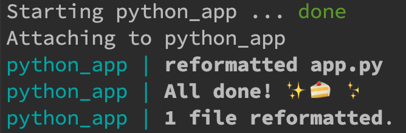

# Code formatting with black

このリポジトリはDockerで環境構築した現在時刻を表示するPythonのプログラムです。

app.pyはあえてコードフォーマットでアラートが出る様にしています。docker-composeコマンドでコンテナを起動する際にBlackでコードフォーマットを自動整形します。

### 1.Dockerイメージを作成

    docker-compose build

### 2.Dockerコンテナを起動

    docker-compose up

スクリーンショット
